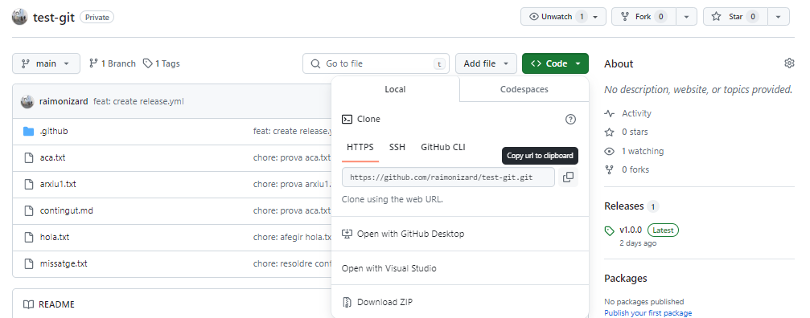
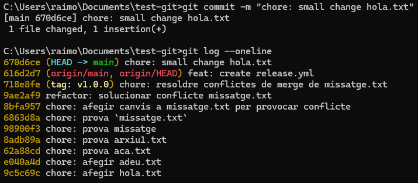

# Integració amb GitHub
Un cop tenim el nostre perfil de GitHub crear, customitzat i el nostre personal token creat, ja podem **usar GitHub** des del **terminal** del sistema operatiu.

## Final del cicle de vida de Git
Amb la plataforma GitHub, afegim l'etapa del ***repositori remot*** al final del cicle de vida de Git:

>[!TIP]
>La captura del cicle de vida ha estat extreta de la web [**ndpsoftware**](https://ndpsoftware.com/git-cheatsheet.html#loc=remote_repo;) on tenim un inventari de les comandes més importants de Git amb la seva pertinent explicació disposades sobre les etapes del flux de treball de Git.

## Clonar un repo remot
Ara podem atacar el cicle de vida de Git pels extrems; és a dir:
1. Des del **repo local** -> **remot**
2. Des del **remot** -> **local**

Començarem per a descarregar un repositori remot hostejat a GitHub i importar-lo com a repositori local en el nostre ordinador.

>[!IMPORTANT]
>Usarem la comanda `git clone url-repositori` per a descarregar-nos el repositori remot.

### Exemple:
1. Naveguem pel portal de GitHub fins a trobar el repositori *públic* que volem descarregar, aleshores sel·leccionem **Code/Copy url to clipboard**:

2. En aquest cas, hem escollit el repositori que podem trobar aquí: [**https://github.com/raimonizard/test-git.git**](https://github.com/raimonizard/test-git.git)

3. Obrim un terminal del SO i naveguem fins a la carpeta de destí on volem descarregar el repositori:
	

	Ara ja tenim el contingut del repositori remot al repositori local:
	

	Podem comprovar l'**històric de commits** del remot vs el del local:
	**Remot:**
	

	**Local:**
	

>[!IMPORTANT]
>A l'històric de commits del repo local hi observem la següent informació:
>`HEAD -> main`: Això ens indica que el repositori local està apuntant (`HEAD`) al commit 616d2d7 i a la branca main; per tant, el codi que ens trobarem dins de la zona confirmada del repositori local, correspondrà a aquesta versió del projecte.
>`origin/main`: Ens indica que el repositori remot, al qual l'anomena com a `origin`, i la seva branca `main` es troba actualitzada fins al commit 616d2d7.
>`origin/HEAD`: Ens indica que el repositori remot (`origin`) es troba apuntant al commit 616d2d7.
>
>Per tant, trobarem la mateixa versió del codi tant en el repositori remot com en el repositori local.

## Push canvis a un repo remot
Ara ja tenim un repositori remot clonat com a repositori local al nostre ordinador.

És hora de fer-hi algun canvi en local i pujar-ho de tornada a GitHub.

1. Modifiquem l'arxiu **hola.txt**:
	

2. Afegim l'arxiu a la zona stating: `git add hola.txt`
	

3. Confirmem el canvi i observem l'històric de commits:
	

>[!IMPORTANT]
>Ara l'històric de canvis ens indica que el repositori local va un commit per davant de la versió del repositori remot.
	

4. Pugem els canvis al repositori remot: `git push`
	

## Crear un repo remot nou
Des de la plataforma GitHub podem crear espais de repositoris remots nous i aleshores linkar-los amb un repositori local o afegir-hi contingut manualment des del web.

Crear repo nou des del portal de GitHub:
	

>[!IMPORTANT]
>Escollirem un **nom** pel nostre repositori (recomanat usar noms en minúsucles i sense espais en blanc)
>És recomanat afegir-hi una **descripció**.
>Podem escollir si fer-lo ***privat*** (només nosaltes el podrem veure); o ***públic*** (estarà disponible al nostre perfil per a tota la comunitat de GitHub)
>Afegir-hi un **README.md** és bona pràctica però hem de saber que aleshores ja ens crea un primer commit des del remot. No és un problema si sabem què està passant, però ens pot portar mal de caps per sincronitzar-ho amb un repositori local si aquest ja conté commits.
>La **llicència** és opcional, però sovint s'usa la llicència *MIT* o *GNU* per denotar que el codi que conté és de lliure ús i distribució. Notar que també ens inicia l'històric de commits igual que al crear el README.md ja que, tant un com l'altre, ens afegeix contingut al repositori remot.

Un cop creat el repositori remot, si hem escollit NO crear README.md ni afegir-hi llicència *(ho podem fer després)*, veurem una pàgina com aquesta:

Ara podem copiar la URL del repositori remot que ens ha generat; en aquest cas: https://github.com/git-github-curs-xtec/curs-git-i-github.git i afegir-la com a repositori remot en el nostre repositori local `git remote add origin url-repo-remot`:

Establir el nom amb el qual ens referirem al repo remot `origin` i la branca que volem sincronitzar amb la branca activa del local `main` i en pujarem el contingut.

Usarem la comanda: `git push -u origin main`

Comprovar el contingut dins del repo remot:
	

## Fer un fork d'un repo remot
L'acció de **fork** serveix per a crear un nou repositori remot clonant un repositori remot actual.

Això ens serveix per tal d'importar el codi del repositori públic d'un altra persona i incorporar-ne una còpia en el seu estat actual en el nostre haver de repositoris remots del nostre perfil. A més a més, podrem modificar la nostra còpia del codi sense afectar al repositori remot original.

L'acció de **fork** es troba disponible a través de GitHub dins de les opcions d'un repositori:

>[!TIP]
>Un repositori que ha estat creat a partir d'un fork, s'enrecorda sempre del seu repositori d'origen i, si en el futur aquest té actualitzacions, ens proposarà si volem actualitzar també la nostra còpia important-ne els canvis.

